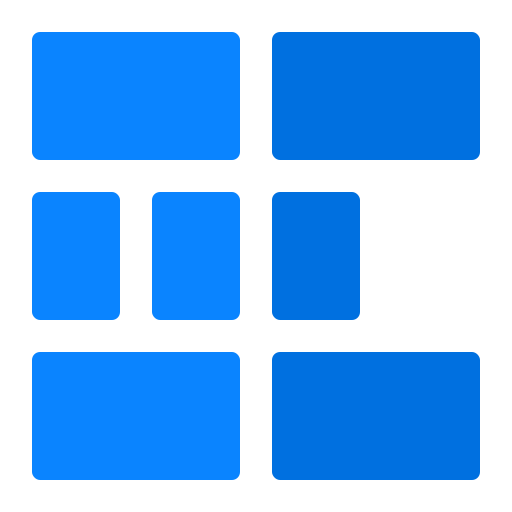
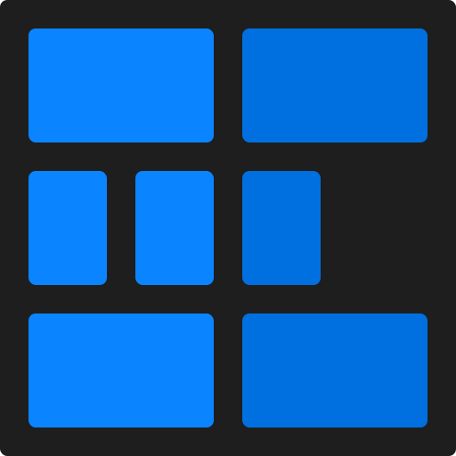
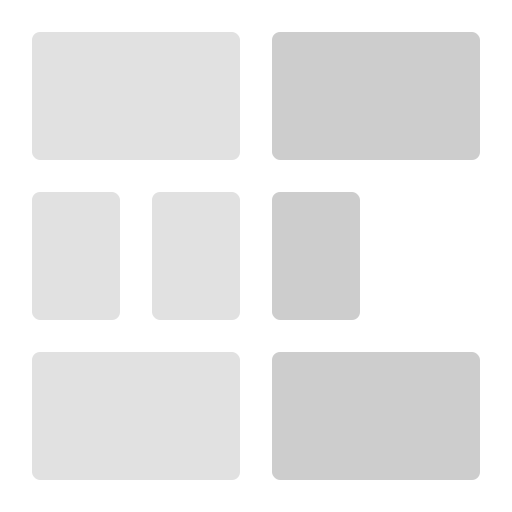
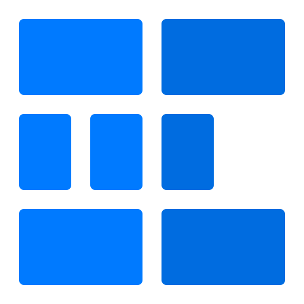
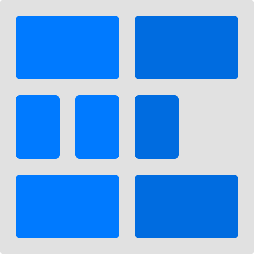
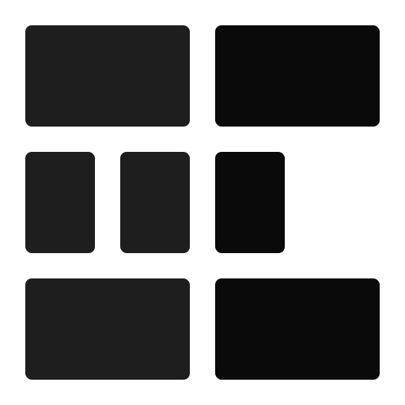

  

    
    <h1>@Schemed/Brand</h1>
  

  

    Branding materials for Schemed template engine.
  

## Table of Contents

1. [Icon](#icon)
2. [Logo](#logo)

## Icon

| Background  |                               Preview                               |    Original File    |                                    Link                                     |
| :---------: | :-----------------------------------------------------------------: | :-----------------: | :-------------------------------------------------------------------------: |
| Transparent |       |   [🔗](icon.svg)    |   `https://raw.githubusercontent.com/schemed-js/brand/master/icon.svg`    |
|    Fill     |  | [🔗](icon-fill.svg) | `https://raw.githubusercontent.com/schemed-js/brand/master/icon-fill.svg` |

## Logo

| Palette | Style | Background  |                                  Preview                                  |       Original File       |                                       Link                                        |
| :-----: | :---: | :---------: | :-----------------------------------------------------------------------: | :-----------------------: | :-------------------------------------------------------------------------------: |
|  Dark   | Main  | Transparent |        |    [🔗](dark/main.svg)    |    `https://raw.githubusercontent.com/schemed-js/brand/master/dark/main.svg`    |
|  Dark   | Main  |    Fill     |   | [🔗](dark/main-fill.svg)  | `https://raw.githubusercontent.com/schemed-js/brand/master/dark/main-fill.svg`  |
|  Dark   | Mono  | Transparent |        |    [🔗](dark/mono.svg)    |    `https://raw.githubusercontent.com/schemed-js/brand/master/dark/mono.svg`    |
|  Dark   | Mono  |    Fill     |   | [🔗](dark/mono-fill.svg)  | `https://raw.githubusercontent.com/schemed-js/brand/master/dark/mono-fill.svg`  |
|  Light  | Main  | Transparent |       |   [🔗](light/main.svg)    |   `https://raw.githubusercontent.com/schemed-js/brand/master/light/main.svg`    |
|  Light  | Main  |    Fill     |  | [🔗](light/main-fill.svg) | `https://raw.githubusercontent.com/schemed-js/brand/master/light/main-fill.svg` |
|  Light  | Mono  | Transparent |       |   [🔗](light/mono.svg)    |   `https://raw.githubusercontent.com/schemed-js/brand/master/light/mono.svg`    |
|  Light  | Mono  |    Fill     |  | [🔗](light/mono-fill.svg) | `https://raw.githubusercontent.com/schemed-js/brand/master/light/mono-fill.svg` |
